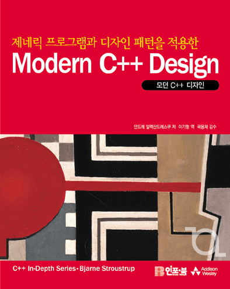

=================
Modern C++ Design
=================

About the C++ Source Code
-------------------------

**Origin** : `sourceforge.net
<http://sourceforge.net/projects/loki-lib/files/Source%20Code/>`_

**License** : `MIT <http://opensource.org/licenses/mit-license.php>`_

**Author** : `Andrei Alexandrescu & Many Contributors
<http://sourceforge.net/project/memberlist.php?group_id=29557>`_

About the UML diagrms
---------------------

**License** : `MIT <http://opensource.org/licenses/mit-license.php>`_

Same license applies.

Journeyer J. Joh

